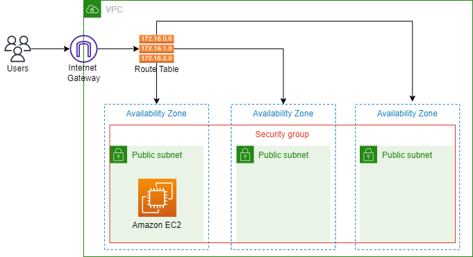

<h1 align="center">
    <a href="https://pt-br.reactjs.org/">☁️ KT Terraform</a>
</h1>
<p align="center">🚀 Automação de serviços da AWS via Terraform.</p>

### Proposta

- [x] Criar uma VPC, não pode ser a default da conta;
- [x] Criar 3 subnets uma em cada AZ dentro da nova VPC;
- [x] Criar 1 Internet Gateway;
- [x] Criar 1 Security Group com regras de acesso as portas 80 e 22;
- [x] Criar 1 EC2 com nginx ativo e acessivel pela porta 80;
- [x] Criar 1 Bucket S3 sem acesso a internet para servir de repositorio para o terraform.tfstate;
- [x] Criar um módulo que provisiona a EC2 e utilizar ele para subir sua infra.

**Arquitetura da Automação:**

Para realizar a proposta de automação foi desenvolvido o sistema abaixo:

<p align="center">
   />
</p>

<details><summary>Bucket S3</summary>

```js
resource "aws_s3_bucket" "kt-terraform" {
  bucket = "kt-terraform-luis" 

  
  versioning {
    enabled = true
  }
  
  tags = {
    Description = "Armazenamento do arquivo do terraform.tfstate"
    ManagedBy   = "Terraform"
    Owner       = "Luis Campos"
    CreatedAt   = "2022-02-05"
  }
}

```
testee

```js
terraform {

  required_providers {
    aws = {
      source  = "hashicorp/aws"
      version = "3.23.0"
    }
  }
  
  backend "s3" {
    bucket  = "kt-terraform-luis"
    key     = "kt/repositorio/terraform.tfstate"
    region  = "us-east-1"
    profile = "luis"
  }
}
```

</details>

<details><summary>VPC</summary>

```js
resource "aws_vpc" "vpc" {
  cidr_block = "192.168.0.0/16"
  tags       = merge(local.common_tags, { Name = "Terraform VPC" })
}
```
</details>

<details><summary>Subnet</summary>

```js
resource "aws_subnet" "subnet" {
  for_each = {
    "sub_a" : ["192.168.1.0/24", "${var.aws_region}a", "Subnet A"]
    "sub_b" : ["192.168.2.0/24", "${var.aws_region}b", "Subnet B"]
    "sub_c" : ["192.168.3.0/24", "${var.aws_region}c", "Subnet C"]
  }

  vpc_id            = aws_vpc.vpc.id
  cidr_block        = each.value[0] 
  availability_zone = each.value[1]
  tags              = merge(local.common_tags, { Name = each.value[2] })
}
```
</details>

<details><summary>Internet Gateway</summary>

```js
resource "aws_internet_gateway" "igtw" {
  vpc_id = aws_vpc.vpc.id
  tags   = merge(local.common_tags, { Name = "Terraform IGW" })
}
```
</details>

<details><summary>Security Group</summary>

```js
resource "aws_security_group" "sg" {
  name        = "SG Terraform"
  description = "Allow public inbound traffic"
  vpc_id      = aws_vpc.vpc.id
  tags        = merge(local.common_tags, { Name = "SG Terraform" })
  
  ingress {
    from_port   = 80 
    to_port     = 80 
    protocol    = "tcp"
    cidr_blocks = ["0.0.0.0/0"]
  }
  
  ingress {
    from_port   = 22 
    to_port     = 22 
    protocol    = "tcp"
    cidr_blocks = ["0.0.0.0/0"]
  }
  
  egress {
    from_port   = 0
    to_port     = 0
    protocol    = "-1"
    cidr_blocks = ["0.0.0.0/0"]
  }
}
```
</details>

<details><summary>EC2 com nginx (Modularizado)</summary>

```js
resource "aws_instance" "this" {
  ami                         = var.ami
  instance_type               = var.instance_type
  key_name                    = aws_key_pair.my_key.key_name
  vpc_security_group_ids      = [aws_security_group.sg.id]
  subnet_id                   = aws_subnet.subnet["sub_a"].id
  tags                        = merge(local.common_tags, { Name = "Nginx Instance" })
  associate_public_ip_address = true
  user_data                   = filebase64("nginx.sh")
}
```
</details>